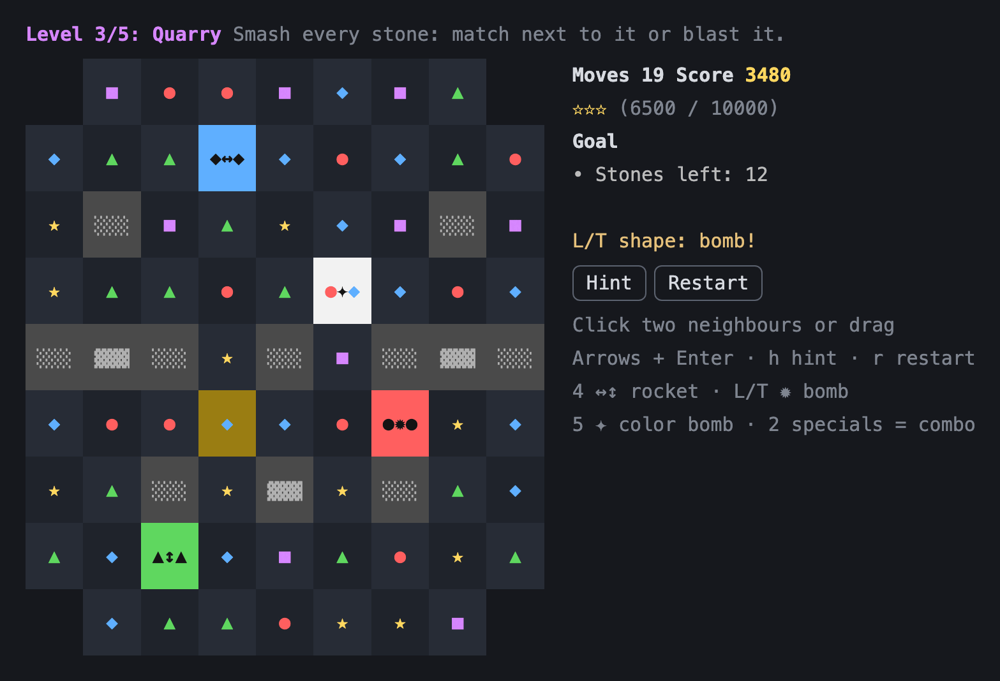

# Match-3 for Claude Code

A match-3 puzzle game as a [Claude Code mod](https://code.claude.com/docs/en/plugins/mods/overview). Type `/match3` and the board opens in a pane next to your session: swap gems, build rockets and bombs, chain combos, and play through five levels while Claude works.



## Install

Claude Code v2.1.287 or later (Desktop app: v2.1.286 or later).

```bash
claude plugin marketplace add nachtgold/claude-code-match-3
```

```bash
claude plugin install match-3@nachtgold
```

In a running session, run `/reload-plugins` afterwards.

## Play

- `/match3` opens the game and resumes the level you are on.
- `/match3 new` starts again at level 1.
- **Mouse:** click two neighbouring gems, or drag a gem onto its neighbour.
- **Keyboard** (click into the board first): arrows move the cursor, Enter picks a gem, an arrow swaps it. `h` hint, `r` restart.

The levels come one after another. Clear a level's goal and the next one starts. Run out of moves and you retry the same level. Your current level and best scores are saved across sessions.

## Gems and specials

Five colors: ● red, ★ yellow, ▲ green, ◆ blue, ■ purple.

| Match | Creates | Effect |
| --- | --- | --- |
| 4 in a row | ↔ / ↕ rocket | clears its whole row or column |
| L or T shape | ✹ bomb | blasts the 3×3 area around it |
| 5 in a row | ✦ color bomb | swap it with a gem: every gem of that color is cleared |

Specials are tiles filled with their color, the color's shape on both sides and the effect's mark in the middle (●↔●, ◆↕◆, ▲✹▲), so you can tell their color by shape too. They match like a gem of that color.

A special caught in another blast fires too, so chain reactions happen. Each cascade raises the points multiplier.

### Combos: swap two specials

| Swap | Effect |
| --- | --- |
| rocket + rocket | a full row and column cross |
| rocket + bomb | a cross three rows and three columns wide |
| bomb + bomb | a 5×5 blast |
| color bomb + rocket / bomb | every gem of that color turns into that special and fires |
| color bomb + color bomb | clears the whole board |

## Levels

| # | Level | Goal | Moves |
| --- | --- | --- | --- |
| 1 | Meadow | open 8×8 board, reach 4000 points | 20 |
| 2 | Ice Cellar | break all the ice, some of it two layers thick | 26 |
| 3 | Quarry | smash every stone (some take two hits) on a board with holes | 28 |
| 4 | Hourglass | collect 25 red and 25 blue through a three-column waist | 24 |
| 5 | Treasure Vault | bring 3 treasures ($) to the bottom past chained gems | 30 |

Each level awards one to three stars by score, and moves left over count as a bonus.

## Language

The game speaks English or German. By default it follows Claude Code's `language` setting, then your system locale (`LC_ALL`, `LC_MESSAGES`, `LANG`). To choose yourself, run `/plugin configure match-3@nachtgold` and set **Language** to `en` or `de`.

Das Spiel gibt es auf Deutsch und Englisch: Es folgt der `language`-Einstellung von Claude Code bzw. der Systemsprache, oder du stellst es unter `/plugin configure match-3@nachtgold` fest ein.

## Where it runs

The board draws in the terminal and in the Code tab of the Desktop app. In the terminal, the pane and mouse input need Claude Code's fullscreen layout. In VS Code and on mobile the command only prints a note.

## What it touches

`claude plugin validate .` lists everything the mod hooks and calls. It registers the `/match3` command, opens one pane, reads Claude Code's settings and the `LC_ALL`, `LC_MESSAGES` and `LANG` variables to pick a language, and keeps your progress in the plugin's own store. It reads no files and makes no network requests.

## Develop

```bash
claude plugin test .
```

The rules (matching, specials, gravity, goals) live in [`hooks/engine.ts`](hooks/engine.ts), the board in [`hooks/game.tsx`](hooks/game.tsx), and the command and pane in [`hooks/register.tsx`](hooks/register.tsx). To try local changes, start Claude Code with `claude --plugin-dir .`.

## License

[MIT](LICENSE) © nachtgold
